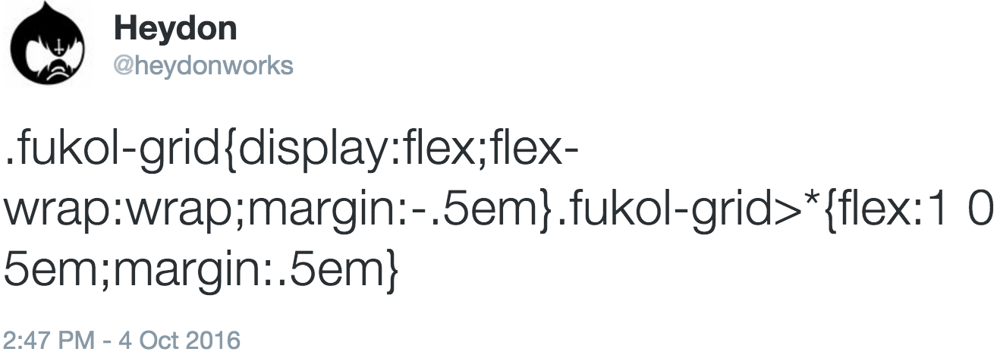
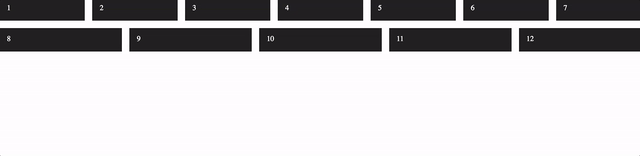

# 

**Fukol&trade;** is a lightweight, breakpoint free, completely responsive, element query driven\*, progressive enhancement based CSS grid framework. It exists in this `README.md` file, in the section titled **The CSS** (below). It is **93 bytes** minified, fitting comfortably inside a tweet:



Just edit the lines marked 'edit me!' to your requirements and write an HTML structure like the one illustrated in the section titled **The HTML** (also below).

(\* Not really, but kind of. See **3**, below.)

## The CSS

```css
.fukol-grid {
  display: flex; /* 1 */
  flex-wrap: wrap; /* 2 */
  margin: -0.5em; /* 5 (edit me!) */
}

.fukol-grid > * {
  flex: 1 0 5em; /* 3 (edit me!) */
  margin: 0.5em; /* 4 (edit me!) */
}
```

## The HTML

```html
<div class="fukol"> <!-- 6 -->
  <ul class="fukol-grid">
    <li><!-- grid cell/item/child/whatever --></li>
    <li><!-- grid cell/item/child/whatever --></li>
    <li><!-- grid cell/item/child/whatever --></li>
    <li><!-- grid cell/item/child/whatever --></li>
    <li><!-- grid cell/item/child/whatever --></li>
    <li><!-- grid cell/item/child/whatever --></li>
    <li><!-- grid cell/item/child/whatever --></li>
    <li><!-- grid cell/item/child/whatever --></li>
  </ul>
</div>
```

1. **Fukol&trade;** is a Flexbox based grid system. Even Opera Mini supports Flexbox. Older user agents that don't support Flexbox ignore the `display: flex` declaration, degrading to a single column layout. No harm done.
2. This line determines how items are handled. The `wrap` value means items will start a new row if there's not enough room on the current one.
3. This is the 'element query' part. Instead of setting an arbitrary number of columns and using breakpoints, we decide roughly how wide we want the item to be (`5em` in the example — the flex basis) and make sure items can grow to use the available space (`1`) but not shrink (`0`). So only change the `5em` value and leave `1 0` as it is.
4. This is for gutters. A `0.5em` margin here means gutters of `1em` (the margins double up).
5. This should always be a negative version of **4**. It compensates for the margins created by the items. It makes sure the outside of the `.fukol-grid` container remains flush horizontally and no additional margin is added to the vertical flow.
6. The `class="fukol"` container in the HTML snippet enables you to add positive margins around the grid — not possible with just `.fukol-grid` because this uses negative margins (see **5**). It also suppresses horizontal scrolling issues which occur under certain circumstances.

## Demos

### Here's a gif



### Play around on CodePen

[codepen.io/heydon/pen/dpzwVd](http://codepen.io/heydon/pen/dpzwVd)

## Items with different widths

Sometimes you want certain items to be narrower or wider. Maybe you want the fifth item to always be approximately twice the size of a regular item (where space permits). If the regular `flex-basis` is `5em`, then&hellip;

```css
.fukol-grid > *:nth-child(5) {
  flex-basis: 10em;
}
```

Don't worry, flexbox will make sure there aren't any gaps.

### Percentage widths

You can choose a percentage based width for individual items, but remember to adjust for the gutter margin with `calc`. For example, to make the first item 100% in width use:

```css
.fukol-grid > *:first-child {
  flex-basis: calc(100% - 1em);
}
```

## RTL Grids

Flexbox supports `rtl` already. Just add `dir="rtl"` to the `.fukol-grid` element and the flex direction will automatically be reversed.

## FAQs

1. *How do I install Fukol&trade;? Is it on bower/npm?* You install it by copy/pasting it from this `README.md` file. See the **The CSS** section above.
2. *How do I pronounce Fukol?* Fukol is pronounced "the square root of fuck all".
3. *Is Fukol&trade; the answer to all my grid system hopes and dreams?* No. Fukol&trade; is just a servicable solution, written with very little code.
4. *Why are there a load of old dicks in the Fukol&trade; logo? Are you some sort of misogynist?* No, fuck the patriarchy. There are a load of old dicks in Fukol&trade;'s logo because grid systems are a load of old dicks.
5. *Is there a Sass version?* Yes: inside your head.

## That's it

That's it.
